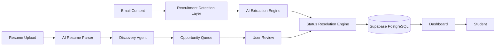

# Internship Tracker

<p align="left">
  
  
  
  
  
  
</p>

An intelligent recruiting CRM that extracts recruitment updates from email content using AI, maintains complete application timelines, and provides real-time analytics through a centralized dashboard. It also includes an AI Recruiting Agent that proactively discovers and ranks new opportunities from real company career pages.

---

⭐ Track the entire recruiting journey without spreadsheets

📈 Designed for students applying to dozens or hundreds of internships

⚡ Real-time application status tracking and analytics

🤖 An AI agent that discovers and ranks new opportunities for you

---

## Project Vision

Students often apply to a large number of internships and full-time roles across multiple platforms.

Tracking progress becomes increasingly difficult as updates arrive through:

- Application confirmation emails
- Online assessment invitations
- Recruiter outreach
- Interview scheduling emails
- Rejection notifications
- Offer letters

Most students currently rely on:

- Spreadsheets
- Notion boards
- Browser bookmarks
- Manual tracking

These approaches quickly become outdated and require constant maintenance.

This platform aims to become a personal recruiting operating system that maintains application records, status changes, and recruiting analytics from recruitment emails provided by the user — and, with the AI Recruiting Agent, proactively finds new opportunities worth applying to in the first place.

---

## Features

### Recruitment Email Detection

Identifies recruitment-related emails from user-provided email content.

Supported sources include:

- Applicant Tracking Systems (ATS)
- Company recruiting teams
- Recruiters
- University hiring portals

Supported email categories:

- Application Received
- OA Received
- Interview
- Rejected
- Offer Received

---

### Application Lifecycle Tracking

Every application is transformed into a structured timeline.

Example:

```text
Applied
↓
Application Received
↓
OA Received
↓
Interview Scheduled
↓
Interview Completed
↓
Offer Received
```

Users can revisit the complete journey of every application from a single dashboard.

---

### Unified Dashboard

Monitor all applications from one place.

Key metrics include:

- Total Applications
- Active Applications
- OA Invitations
- Interviews Scheduled
- Rejections
- Offers
- Response Rate
- Interview Conversion Rate

---

### AI-Powered Information Extraction

The platform extracts:

- Company Name
- Role
- Location
- Recruiter Information
- Current Application Status

Users can paste the contents of a recruitment email and the platform will extract structured application information.

Example:

Input:

```text
Congratulations! You have been selected for the Software Engineering Internship assessment.
```

Output:

```json
{
  "company": "Uber",
  "role": "Software Engineering Intern",
  "status": "OA Received"
}
```

---

### Smart Status Resolution

Prevents duplicate application records by intelligently updating existing entries.

Example:

```text
Application Received
↓
OA Received
↓
Interview Scheduled
```

The existing application is updated instead of creating multiple records.

---

### Real-Time Analytics

Gain insights into recruiting performance.

Metrics include:

```text
Applications Submitted: 120

Responses Received: 42
Response Rate: 35%

Interviews: 9
Interview Conversion Rate: 7.5%

Offers: 2
Offer Conversion Rate: 1.6%
```

---

### Advanced Search & Filtering

Filter applications by:

- Company
- Role
- Status
- Date Range

Quickly locate any application across the recruiting pipeline.

---

### Timeline History

Every application maintains a detailed event history.

Example:

```text
Uber

May 10 → Applied
May 13 → Application Received
May 18 → OA Received
May 24 → Interview Scheduled
```

---

### AI Recruiting Agent

Beyond tracking applications, the platform includes an AI agent that proactively finds new opportunities to apply to.

```text
Resume Upload
↓
AI Resume Parsing
↓
Candidate Profile
↓
AI-Generated Search Queries
↓
Company Career Page Discovery
↓
Embedding-Based Semantic Matching
↓
AI Reasoning (YES / NO / MAYBE + confidence + explanation)
↓
Opportunity Queue
↓
User Review (Accept / Reject)
↓
Application Tracker
```

The agent tracks real company career pages directly — including Google, Microsoft, Amazon, Meta, Apple, Netflix, Stripe, Uber, Airbnb, Anthropic, OpenAI, Databricks, and more — rather than relying on a generic job board.

Core principles:

- **Never fetches every job.** Discovery always starts from the candidate's stated role, location, and graduation-year constraints.
- **Explains every recommendation.** Each queued opportunity shows its match score, AI confidence, and the specific reasons it was surfaced.
- **Learns from feedback.** Accepting or rejecting a role feeds back into future ranking.
- **Nothing is applied automatically.** The agent only queues candidates; the user approves every application before it's tracked.

---

### Privacy First

The platform only processes email content explicitly provided by the user, and the AI Recruiting Agent only crawls publicly available company career page listings — never the user's private inbox.

Features:

- No Gmail access required
- User-controlled data submission
- User-isolated records
- Secure authentication

---

## Recruitment Intelligence Engine

The platform continuously processes recruitment updates using a multi-stage pipeline.

```text
Email Content
↓
Recruitment Detection
↓
AI Extraction
↓
Status Resolution
↓
Timeline Update
↓
Analytics Engine
↓
Dashboard
```

The AI Recruiting Agent runs a parallel discovery pipeline that feeds into the same tracker:

```text
Resume + Preferences
↓
AI Query Generation
↓
Company Career Page Crawling
↓
Embedding Similarity + AI Evaluation
↓
Opportunity Queue
↓
User Review
↓
Dashboard
```

---

## Supabase Integration

The project uses Supabase as the primary backend platform.

### Supabase Services Used

- PostgreSQL Database (with `pgvector` for the AI agent's embeddings)
- Supabase Auth
- Supabase Storage (resume uploads)
- Edge Functions
- Row Level Security (RLS)
- Scheduled Jobs
- Realtime Subscriptions

---

## Database Schema

### users

```sql
id
email
created_at
```

---

### gmail_connections

```sql
id
user_id
gmail_address
last_sync_at
created_at
```

---

### applications

```sql
id
user_id
company_name
role
location
current_status
first_seen_at
last_updated_at
```

---

### application_events

```sql
id
application_id
status
source_email_id
event_timestamp
```

---

### processed_emails

```sql
id
gmail_message_id
sender
subject
received_at
processed_at
```

---

### candidate_profiles

```sql
id
user_id
skills
domains
education
experience_level
graduation_year
preferred_roles
resume_embedding
```

---

### resume_documents

```sql
id
user_id
file_name
storage_path
status
parsed_at
```

---

### user_preferences

```sql
id
user_id
preferred_roles
preferred_locations
graduation_year
target_companies
```

---

### job_sources

```sql
id
company
careers_url
api_type
tier
active
```

---

### discovered_jobs

```sql
id
user_id
company
role
location
embedding
match_score
ai_decision
ai_confidence
ai_reasoning
```

---

### job_queue

```sql
id
user_id
discovered_job_id
status
match_score
ai_reasoning
```

---

### user_agent_feedback

```sql
id
user_id
queue_item_id
decision
```

---

### agent_run_log

```sql
id
user_id
status
jobs_discovered
jobs_queued
current_step
```

---

## Row Level Security (RLS)

All user data is protected through Supabase RLS policies.

Permissions:

- Users → Access only their own records
- Anonymous users → No access
- Service role → Background processing only

---

## Architecture



---

## Performance Optimizations

- Incremental Gmail synchronization
- Duplicate email prevention
- Background processing through Edge Functions
- Cached application metrics
- Optimized PostgreSQL indexing
- Batched status updates
- Query-first job discovery for the AI agent — never fetches all available jobs
- Capped opportunities per agent run, with a hard timeout so runs always terminate
- Cached embeddings and AI evaluations to avoid repeated Gemini calls

---

## Security

### Authentication

- Google OAuth
- Supabase Auth

### Data Protection

- Encrypted OAuth tokens
- Secure API routes
- User-level data isolation
- Read-only Gmail permissions
- Resumes stored in a private Supabase Storage bucket, accessible only to their owner

### Database Security

- Row Level Security
- Protected service roles
- Parameterized database queries

---

## Future Roadmap

### Phase 1

- Recruitment Email Parser
- AI Extraction Engine
- Recruitment Detection

### Phase 2

- AI Extraction Engine
- Status Resolution
- Timeline Tracking

### Phase 3

- Analytics Dashboard
- Search & Filtering
- Real-Time Updates

### Phase 4

- Daily Recruiting Digest
- Email Notifications
- Mobile Optimization
- AI Recruiting Agent (resume parsing, company career page discovery, embedding-based matching, AI reasoning, opportunity queue)

### Phase 5

- Bulk Email Parsing
- Career Insights Engine
- Resume-Aware Analytics
- Scheduled automatic agent runs

---

## Tech Stack

### Frontend

- React
- TypeScript
- Tailwind CSS
- React Query

### Backend

- Supabase
- PostgreSQL
- Edge Functions

### AI

- Gemini API

### Deployment

- Vercel
- Supabase

---

## Environment Setup

Create a `.env` file in the root directory:

```env
VITE_SUPABASE_URL=your_supabase_url
VITE_SUPABASE_ANON_KEY=your_supabase_key
GEMINI_API_KEY=your_gemini_api_key
```

Note: the AI Recruiting Agent's Edge Functions run on Supabase's servers and need their own `GEMINI_API_KEY` secret set directly in the Supabase Dashboard (Edge Functions → Manage secrets) — variables in `.env` are only visible to the frontend.

---

## Getting Started

```bash
npm install

npm run dev
```

Open:

```text
http://localhost:5173
```

---

## Contribution Guidelines

- Fork the repository
- Create a feature branch
- Implement your changes
- Test thoroughly
- Submit a Pull Request

### Before Opening a PR

```bash
npm run lint

npm run build
```

---

## License

This project is open-source and available under the MIT License.

© 2026 All rights reserved.
