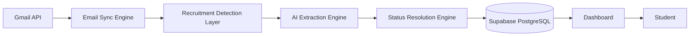
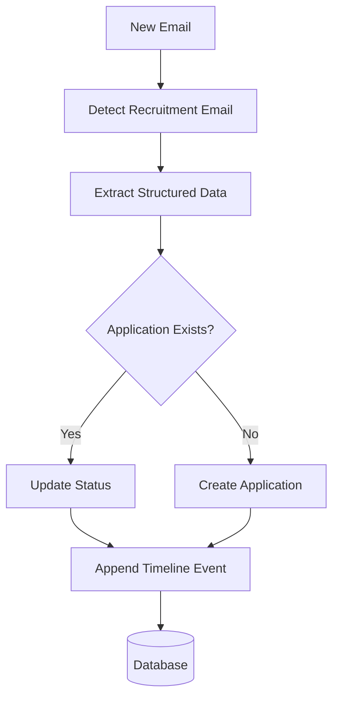

# Internship Tracker

<p align="left">
  
  
  
  
  
  
</p>

An intelligent recruiting CRM that automatically tracks internship and job applications directly from Gmail, extracts recruitment updates using AI, maintains complete application timelines, and provides real-time analytics through a centralized dashboard.

---

[](https://github.com/divyanshgarg380/Internship_Tracker/actions)

---

⭐ Automatically tracks the entire recruiting journey without spreadsheets

📈 Designed for students applying to dozens or hundreds of internships

⚡ Real-time application status tracking and analytics

---

## Project Vision

Students often apply to a large number of internships and full-time roles across multiple platforms.

Tracking progress becomes increasingly difficult as updates arrive through:

- Application confirmation emails
- Online assessment invitations
- Recruiter outreach
- Interview scheduling emails
- Rejection notifications
- Offer letters

Most students currently rely on:

- Spreadsheets
- Notion boards
- Browser bookmarks
- Manual tracking

These approaches quickly become outdated and require constant maintenance.

This platform aims to become a personal recruiting operating system that automatically maintains application records, status changes, and recruiting analytics directly from a user's inbox.

---

## Features

### Recruitment Email Detection

Automatically identifies recruitment-related emails from:

- Applicant Tracking Systems (ATS)
- Company recruiting teams
- Recruiters
- University hiring portals

Supported email categories:

- Application Received
- Under Review
- OA Received
- OA Completed
- Interview Scheduled
- Interview Completed
- Waitlisted
- Rejected
- Offer Received
- Offer Accepted

---

### Application Lifecycle Tracking

Every application is transformed into a structured timeline.

Example:

```text
Applied
↓
Application Received
↓
OA Received
↓
Interview Scheduled
↓
Interview Completed
↓
Offer Received
```

Users can revisit the complete journey of every application from a single dashboard.

---

### Unified Dashboard

Monitor all applications from one place.

Key metrics include:

- Total Applications
- Active Applications
- OA Invitations
- Interviews Scheduled
- Rejections
- Offers
- Response Rate
- Interview Conversion Rate

---

### AI-Powered Information Extraction

The platform extracts:

- Company Name
- Role
- Location
- Recruiter Information
- Current Application Status

Example:

Input:

```text
Congratulations! You have been selected for the Software Engineering Internship assessment.
```

Output:

```json
{
  "company": "Uber",
  "role": "Software Engineering Intern",
  "status": "OA Received"
}
```

---

### Smart Status Resolution

Prevents duplicate application records by intelligently updating existing entries.

Example:

```text
Application Received
↓
OA Received
↓
Interview Scheduled
```

The existing application is updated instead of creating multiple records.

---

### Real-Time Analytics

Gain insights into recruiting performance.

Metrics include:

```text
Applications Submitted: 120

Responses Received: 42
Response Rate: 35%

Interviews: 9
Interview Conversion Rate: 7.5%

Offers: 2
Offer Conversion Rate: 1.6%
```

---

### Advanced Search & Filtering

Filter applications by:

- Company
- Role
- Status
- Date Range

Quickly locate any application across the recruiting pipeline.

---

### Timeline History

Every application maintains a detailed event history.

Example:

```text
Uber

May 10 → Applied
May 13 → Application Received
May 18 → OA Received
May 24 → Interview Scheduled
```

---

### Privacy First

The platform only processes recruitment-related emails.

Features:

- Read-only Gmail access
- Encrypted token storage
- User-isolated records
- Secure OAuth authentication

---

## Recruitment Intelligence Engine

The platform continuously processes recruitment updates using a multi-stage pipeline.

```text
Gmail
↓
Email Sync Engine
↓
Recruitment Detection
↓
AI Extraction
↓
Status Resolution
↓
Timeline Update
↓
Analytics Engine
↓
Dashboard
```

---

## Supabase Integration

The project uses Supabase as the primary backend platform.

### Supabase Services Used

- PostgreSQL Database
- Supabase Auth
- Edge Functions
- Row Level Security (RLS)
- Scheduled Jobs
- Realtime Subscriptions

---

## Database Schema

### users

```sql
id
email
created_at
```

---

### gmail_connections

```sql
id
user_id
gmail_address
last_sync_at
created_at
```

---

### applications

```sql
id
user_id
company_name
role
location
current_status
first_seen_at
last_updated_at
```

---

### application_events

```sql
id
application_id
status
source_email_id
event_timestamp
```

---

### processed_emails

```sql
id
gmail_message_id
sender
subject
received_at
processed_at
```

---

## Row Level Security (RLS)

All user data is protected through Supabase RLS policies.

Permissions:

- Users → Access only their own records
- Anonymous users → No access
- Service role → Background processing only

---

## Architecture



---

## Status Resolution Workflow



---

## Performance Optimizations

- Incremental Gmail synchronization
- Duplicate email prevention
- Background processing through Edge Functions
- Cached application metrics
- Optimized PostgreSQL indexing
- Batched status updates

---

## Security

### Authentication

- Google OAuth
- Supabase Auth

### Data Protection

- Encrypted OAuth tokens
- Secure API routes
- User-level data isolation
- Read-only Gmail permissions

### Database Security

- Row Level Security
- Protected service roles
- Parameterized database queries

---

## Future Roadmap

### Phase 1

- Gmail OAuth
- Email Synchronization
- Recruitment Detection

### Phase 2

- AI Extraction Engine
- Status Resolution
- Timeline Tracking

### Phase 3

- Analytics Dashboard
- Search & Filtering
- Real-Time Updates

### Phase 4

- Daily Recruiting Digest
- Email Notifications
- Mobile Optimization

### Phase 5

- Multi-Mail Support
- Outlook Integration
- Career Insights Engine

---

## Tech Stack

### Frontend

- React
- TypeScript
- Tailwind CSS
- React Query

### Backend

- Supabase
- PostgreSQL
- Edge Functions

### Integrations

- Gmail API
- Google OAuth

### AI

- Gemini API

### Deployment

- Vercel
- Supabase

---

## Environment Setup

Create a `.env` file in the root directory:

```env
VITE_SUPABASE_URL=your_supabase_url
VITE_SUPABASE_ANON_KEY=your_supabase_key

VITE_GOOGLE_CLIENT_ID=your_google_client_id

GEMINI_API_KEY=your_gemini_api_key
```

---

## Getting Started

```bash
npm install

npm run dev
```

Open:

```text
http://localhost:5173
```

---

## Contribution Guidelines

- Fork the repository
- Create a feature branch
- Implement your changes
- Test thoroughly
- Submit a Pull Request

### Before Opening a PR

```bash
npm run lint

npm run build
```

---

## License

This project is open-source and available under the MIT License.

© 2026 All rights reserved.
